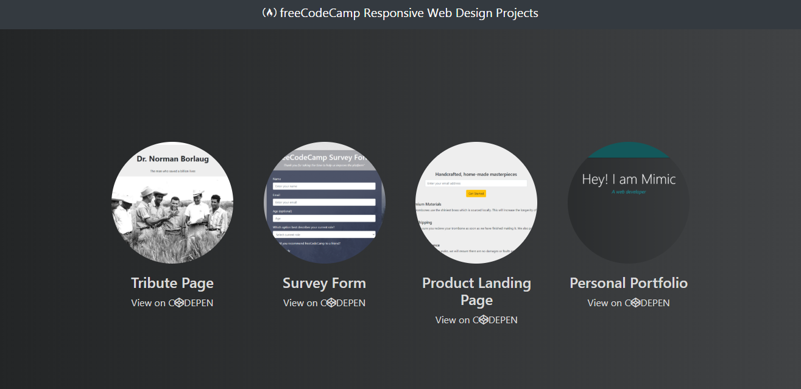

# freeCodeCamp Responsive Web Design Projects

The projects required to obtain the the freeCodeCamp responsive web design certificate at the end of the course. I collected all my four pages in this repository.

A demo of the pages can be viewed [here](https://maryamaljanabi.github.io/fcc-responsive-web-design/.).

## License

- MIT License
- Copyright 2020 © [Maryam Aljanabi](https://github.com/maryamaljanabi)
